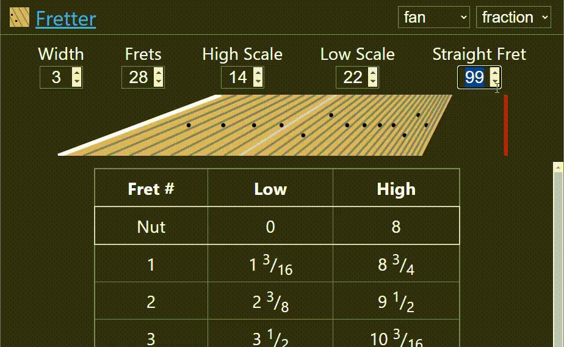
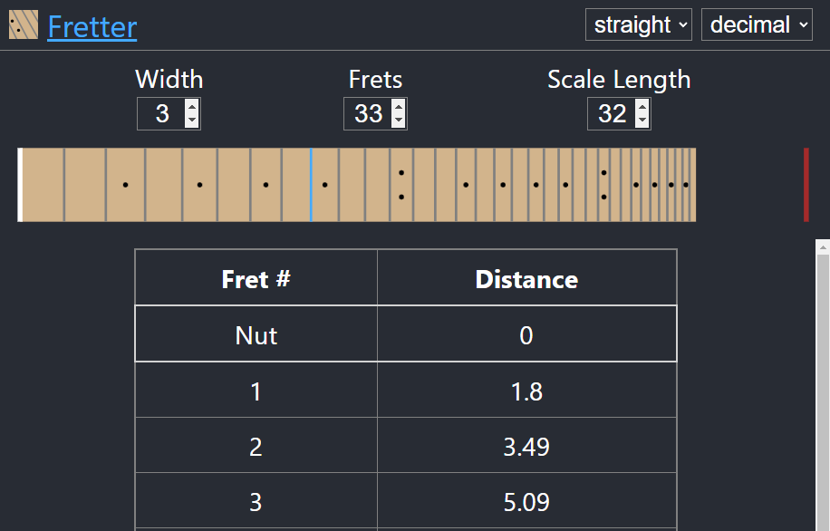
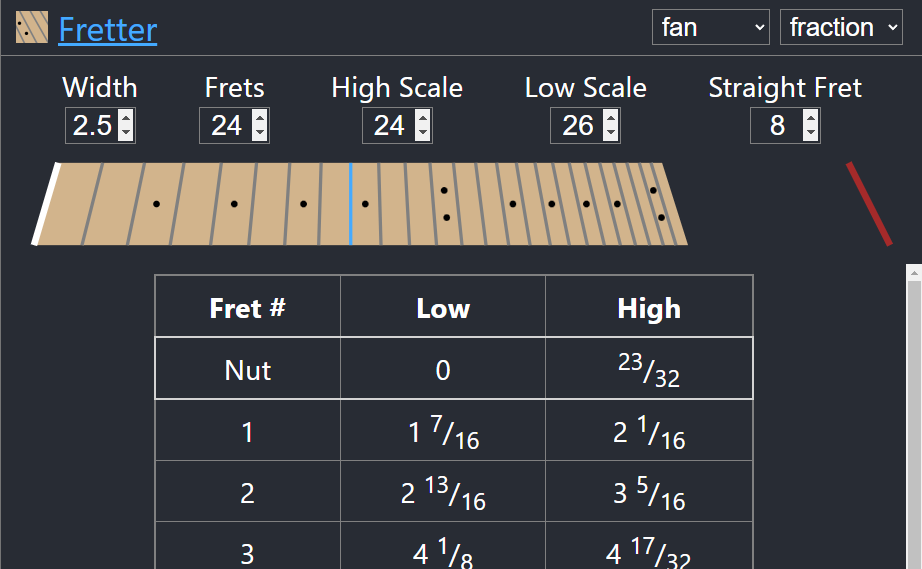

# Fretter

A fret layout tool and visualizer supporting single & multi scale length necks with SVG & CSV export options to support laser cutting and printing.

## Features

- Adjust scale length, number of frets and neck width
- Single scale (straight) or multi-scale (fanned) necks
- Export to CSV or SVG
- Decimal or fractional fret positions

## Single scale

_Single-scale, straight frets_

## Multi scale

_Multi-scale, fanned frets_

- Adjust scale length and neck widtd
- Export to CSV

## Export to SVG

Export the to-scale neck to an SVG for printing or laser cutting. Exported SVGs are compatible with common vector editing programs including Illustrator and Inkscape and work with most laser cutters and engravers including Epilog.

## Try it

Fretter is open source and free to use [online](https://macflash.github.io/fretter)
